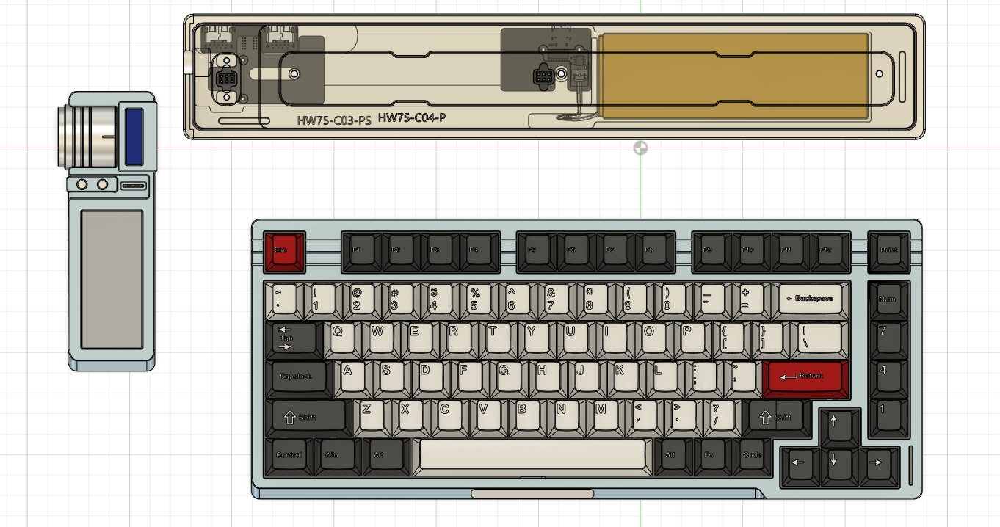
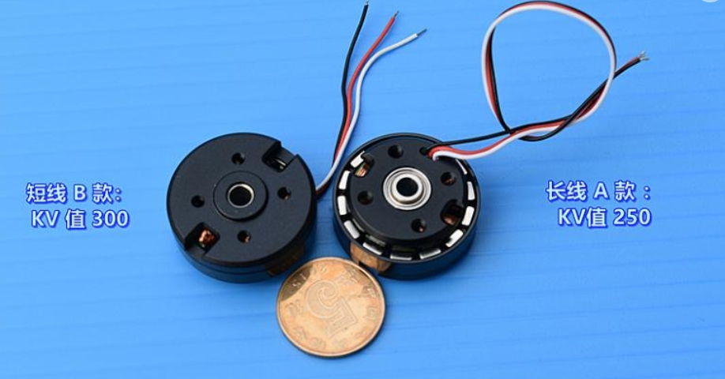

> :warning: Translator notes: Sorry if some text seems kinda weird, I'm using Google Translate to translate the text into English (the 
original texts are in Chinese), as I don't actually speak any Chinese (but I'm re-wording it afterwards to actually make sense, I may just have missed a spot :wink:)

# 【HanWen】HelloWord Smart Keyboard


> `HanWen` Smart keyboard is a **multifunctional, modular** mechanical keyboard I designed for myself.
>
> The keyboard uses a modular design. The **multifunctional scenario interaction module** on the left can be replaced with various custom components. The default is a `dynamic component with an electronic ink screen and the FOC feedback knob`.
> The keyboard firmware and module firmware based on the ARM Cortex-M chip were developed by myself; the keyboard body uses the shift register method to achieve optimized key scan circuits; the module and keyboard body can be used separately, or they can also communicate and call each other through the serial port protocol.
>
> **The content of the open source of this repository includes:**
>
> * 瀚文本体硬件设计的10块PCB设计源文件，提供立创EDA专业版的文件格式
> * Shell design structure file
> * The firmware source code of the keyboard body (has been relatively complete)
> * The firmware source code of Dynamic component (the framework has been completed, more app extension WIP)
> * The secondary development of the keyboard SDK (under development)
>
> **Demonstration of the keyboard can be found here:**
>
> * [【自制】我做了一把 模 块 化 机 械 键 盘 !【软核】_哔哩哔哩_bilibili](https://www.bilibili.com/video/BV19V4y1J7Hx)
>
> * [I Made A Customized Modular Keyboard ! - YouTube](https://www.youtube.com/watch?v=mGShD9ZER1c)

**Note: ISSUES discusses the topic of project development. Don't send meaningless messages inside, otherwise people in the repository will receive notification emails for no good reason! Topics not related to development can be discussed in the DISCUSSIONS of the repository!**

---

## 1. Project Instructions

### 1.0 Release Notes:

**22.8.31更新：**

* 添加`Test-Dynamic-fw.bin`测试固件，烧录到模块之后可以体验各种不同力反馈的滚轮效果。

  > * 注意测试版固件会在每次上电之后校准电机，如果校准失败需要重新上电（未来正式使用的时候校准只需要一次就行了）;
  > * 模块上两个按钮可以切换不同模式;
  > * 硬件上有一个地方需要注意的地方是模块的fpc线一定要选短一点的，不然电阻太大会影响压降，同时需要先自己确认一下编码器是正常工作的（可以用Debug查看编码器数据）。

**22.8.22更新：**

* 添加STEP格式的3D模型文件，全套包括定位板的模型都发出来了.

**22.8.20更新：**

* PCB工程更新，见仓库的工程链接，所有元器件能在立创直接下单的都改成了对应的封装，方便大家配置BOM.

**22.8.13更新：**

* 新打样的PCB已经收到，但是由于何同学这周发视频，为了避免带来不必要的压力，所以决定错峰下周六再把PCB工程更新（doge）.

**22.7.31更新：**

* 添加键盘硬件所有设计原理图文件（电路还有些bug没修复，如视频里的飞线，会晚些等新版PCB打样收到验证没问题后更新）
* 添加键盘固件源代码
* 添加Dynamic组件源代码

### 1.1 Project file description:

#### 1.1.1 Hardware

In the Hardware folder are the schematic diagrams and PCB files of all the circuits used in the Hanwen keyboard. Currently, the source files in [Lichuang EDA Professional Edition](https://oshwhub.com/pengzhihui/b11afae464A3E8D0F77E1F92DC7B7) format and the light drawing files in Gerber format are provided for direct processing by manufacturers.


The full keyboard contains the following PCBs:

- **HelloWorld-Keyboard:** The PCB of the main keyboard, the controller is a STM32F103, which can be used alone with the base, providing conventional keyboard functionality, with full key independent RGB lights.
- **HelloWord-Ctrl:** The PCB of the Dynamic component on the left, the controller is a STM32F405, which can be used alone with the base, providing the FOC force feedback knob, E-ink screen display, OLED display, RGB lights and other functions.
- **HelloWord-Connector:** The PCB connecting the main keyboard module to the contact PCB of the base, and is connected to the keyboard PCB through the FFC cable.
- **HelloWord-Connector-Ctrl:** The PCB connecting the Dynamic component module to the contact PCB of the base, and is connected to the Dynamic component PCB through the FFC cable.
- **HelloWord-Encoder:** Magnetic encoder PCB, used for position feedback of brushless motor, needs to work with a radially magnetized permanent magnet.
- **HelloWord-Hub1:** The two additional USB-A ports extended on the base are connected to the PCB, and are connected to the TypeC interface board through the FFC cable.
- **HelloWord-Hub2:** The two extra USB-A sockets on the base are reserved for the USB3.0 sockets and pins, but only the 2.0 interface is currently used, and it can be upgraded to a USB3.0 HUB in the future.
- **HelloWord-TypeC:** The TypeC interface PCB used to connect to the computer on the base is equipped with a power charging management chip and a USB-HUB chip, which are connected to the rest of the modules through FFC cables.
- **HelloWord-OLED:** Minimal driver circuit and adapter board for OLED screen on the Dynamic component module.
- **HelloWord-TouchBar:** The optional capacitive touch bar module PCB uses 6-button capacitive touch chips to form a linear sensing array, which is connected to the main keyboard PCB through the FFC cable.

#### 1.1.2 Firmware

Firmware provides the firmware source code of all the above boards, and the **precompiled bin firmware** can be directly burned, mainly including the following two projects:

* **HelloWord-Keyboard-fw:** The firmware of the main keyboard mainly realizes high-speed key scanning based on hardware SPI and shift register, bus RGB light control based on hardware SPI & DMA, HID high-speed device keyboard enumeration & message protocol implementation, non-volatile storage configuration, multi-layer Button mapping and other functions.
* **HelloWord-Dynamic-fw:** The firmware of the Dynamic component mainly implements functions such as FOC-based motor control code, configurable touch-sensitive packaging, e-ink screen driver, OLED driver, USB full-speed composite device enumeration and communication protocol, and RGB light control.

The projects are all implemented based on STM32HAL, so the corresponding `.ioc` file is provided, which can be opened with STM32CubeMX by yourself to generate the corresponding keil or STM32IDE project file. You can also compile and download with CLion or STM32CubeIDE like me.

The `_Release` folder is a precompiled bin file, which can be downloaded directly to the chip with software such as **ST-Link Utillity** or STM32CubeProgrammer.

The implementation details of the firmware are explained later.

> For the method of turning CLion into an IDE for STM32, refer to a tutorial I posted before: [Configuring CLion for STM32 Development [Elegant Embedded Development]](https://zhuanlan.zhihu.com/p/145801160).

#### 1.1.3 Software

Software provides some computer-side PC software for interacting with the keyboard, including the PC software for foolishly modifying the picture of the ink screen demonstrated in the video, and the graphical software for **modifying the key positions will be gradually supplemented in the future* *App store software for adding APP** to the **module, these are still under development.

#### 1.1.4 Tools

Tools mainly provides some third-party tool software, such as **STM32 ST-LINK Utility**, **zadig** for installing drivers, and so on.

#### 1.1.5 3D Model

In the folder are the 3D model files of all the structural parts used in the keyboard, which can be used for 3D printing.

#### 1.1.6 Docs

Relevant reference documents, including the chip's Datasheet, etc.

## 2. Hardware Architecture Description

**Structural Design**

The structure of HanWen consists of three parts: **docking station (base)**, **keyboard module** and **replaceable multi-function interaction module (dynamic component)**. The keyboard module and the replaceable multi-function interaction module are attached to the top of the docking station base via contact pins:



The keyboard body is also a standard customized keyboard laminated structure design, including shock-absorbing cotton, PCBA, positioning plate, shaft underpad, etc.:


The structural design of the keyboard is mainly modified by Xikii according to the S98. It is a 75-key layout. People who need other layouts can modify the PCB and firmware adaptation by themselves.

> Regarding the structural parts shown in the video, it is not easy for me to release the source files without authorization because it is Xikii's solution, and the original version of the structure is used for CNC machining, so the cost will be relatively high.
>
> So I also asked Xikii to help design a simplified version of structural parts that can be used in 3D, and open source it and put it in the repository.

**Chip Selection**

- The chip used for the keyboard master control is a STM32F103CBT6. In fact, a C8T6 can also be used, but considering the scalability of future firmware functions, the CBT6 with twice the size of Flash is more cost-effective. Since my firmware is basically implemented using the HAL library, the main control can also be replaced with any chip of the STM32 series. The support chip needs to have 2 SPI hardware interfaces for key scanning and RGB light driving respectively. , and a full-speed USB interface.
- The STM32F4 controlled by the Dynamic component, this is because I have a lot of this chip at hand, and theoretically it can be replaced with a more cost-effective F1 series, as long as the chip has an advanced timer for PWM generation and 2 hardware SPI interfaces for coding Communication with the e-ink screen, an I<sup>2</sup>C interface for the OLED driver, and a full-speed USB interface are enough.
- The magnetic encoder chip of the motor is a AS5047P, which is also a very commonly used magnetic encoder chip with good performance, but the cost is slightly higher. I just chose this one because I have it at hand, and it can also be modified to other cheaper models. For example, the MT6816, etc. Of course, the firmware driver code would need to be modified.
- The 74HC165 used as the shift register for key scanning is about 0.5 yuan per piece for domestic chip retail, and one piece can drive 8 keys. You can modify the serial register chip according to the number of keys you need. The imported 165, such as TI, is more expensive than the domestic one, and the performance will be slightly better. However, since the key scan frequency of 4MHz is sufficient in this project, even the domestic 16MHz chip is more than enough.
- The capacitive touch panel is realized by a 6-channel capacitive touch button chip XW06A, which has certain requirements for the design of the PCB induction panel, and the warehouse has provided the designed PCB. The reading method of this chip is actually no different from ordinary buttons, so a 74HC165 is also used for scanning and reading in this scheme.
- The motor FOC driver circuit was completely ported from my Ctrl driver, using the FD8288Q as the gate driver, no current sensor needed.

**Burning Method**

Use Jlink, Stlink and other debuggers to burn, I reserved the SWD debug port on both PCB and shells. For people who have no hardware development experience, I will also release a Bootloader later, which can be upgraded directly through the USB port.

**Electrical selection**

I use a 2204 second -hand motor, but this motor seems not easy to buy. You can choose a brushless motor replacement of similar size. The parameter requires that the KV value is lower, preferably about 200.The motor needs to manually install a radial permanent magnet on the rotor for the positioning of the encoder, and the motor of different models needs to be adjusted to the FOC parameter.



## 3. Software Architecture Description

**How the keys of the keyboard firmware are mapped**

In order to give full play to the advantages of the shift register scanning scheme mentioned in the video, the firmware code decouples the PCB Layout traces and the key scanning sequence, and performs remapping through software. That is to say, the connection of the buttons in the PCB can be arbitrary. After the line is completed, the mapping method can be specified in `keyMap[KEYMAP_NUM][IO_NUMBER]` in the `hw_keyboard.h` file.

> This is a two-dimensional array, representing a `KEYMAP_NUM` layer key mapping, each layer has `IO_NUMBER` keys (that is, the number of keys on your keyboard); the 0th layer is special, responsible for mapping the random number of PCB keys From the layout to the keyboard standard key layout, the subsequent layers 1, 2, 3, 4... are all customized and responsible for mapping the standard key layout to any layout.

**For example:**

Consider the button pointed by the arrow in the schematic diagram, this button can be anywhere on the PCB, but we can see that it is the 10th button from left to right (in the connection order of 74HC165, that is, the shift scan order), So it is numbered 9 (counting from 0).


If we put it in the **right Alt** position on the actual PCB board, then refer to the `RIGHT_ALT` in the layer 1 mapping (that is, the standard layout) in the **red box** in the code below. The serial number is 76, then the 76th variable mapped in the 0th layer is filled with 9 (blue box).

In this way, all the keys on your PCB are filled in layer 0 mapping in turn, and a mapped standard keyboard is obtained. Subsequent layers 2, 3, 4, 5, etc. can be modified and added as needed, and there is no need to use the number number, but it is very convenient to directly use the enumerated button name.

> Therefore, for those who want to modify the keyboard layout, they only need to add or delete a few 74HC165 in series on the schematic diagram, then route the PCB at will, and then delete or add some numbers to the 0-layer mapping in the code (for example, in the following In the example, my keyboard is 83 keys); the modification of the following layers is analogous.

The code uses the `keyboard.Remap` function to map different layers. For example, the sentence `keyboard.Remap(2)` uses the second layer mapping.


**Filtering method of the keyboard firmware**

The firmware uses independent filtering for each key, but it is implemented in a very efficient way (after all, for a 1KHz message, at least two keys are scanned during each message, which means that **1000\*2\*[number of keys]** times of filtering).

The basic principle is very simple, that is, the reason for the button jitter is that after pressing it, it will jump repeatedly between high and low levels. This stabilization time is generally tens of us (note that it is the level stabilization time, not the button trigger time, the latter is due to caused by the uncertainty of the contact time of the key reed, which may be as long as several ms).

Several filtering methods are described in QMK's [qmk_firmware/feature_debounce_type](https://github.com/qmk/qmk_firmware/blob/master/docs/feature_debounce_type.md) document, which are divided into Eager and Defer, symmetric and asymmetric etc.,

The default is to use **symmetric delay global filtering**, which means that all buttons are equally filtered, and all buttons are stable and no longer change, and then submit the scan data.

> Corresponding to it is the aggressive filtering method, that is to say, once the key change is detected, the data is submitted, but no more keys will be responded to within N milliseconds after that (which also avoids submitting the jittering keys). This method has a low trigger delay, but is very sensitive to noise and is prone to false triggering.

What I use in the HanWen's firmware is **symmetric delay independent filtering**, that is, each button is detected twice, if the button change is detected for the first time, then the interval is N microseconds (this parameter can be configured, If it is longer than the typical jitter time of the key, check it again. If the two detection results are consistent, it is judged that the key is pressed. At this time, it can be ensured that the key has changed, and the key will not be triggered repeatedly, taking into account the delay and stability.

This process is efficiently processed by XOR operation. Just because the key buffer is scanned by the shift register, each bit itself represents a key, so the filtering efficiency is very high, and the measured effect is also very good.


**HID descriptor for keyboard firmware**

This can directly refer to the `usbd_customhid.c` file of the source code. I have configured two ReportIDs, ID-0 is for reporting key scan data (all keys are not overrun), and ID-1 is reserved for subsequent changes to the host computer for keyboard software communication.

**RGB control**

The single-bus ws2812b series lamp beads are used in the code, and a large number of RGB can be connected in series with one line, and the SPI-DMA simulation timing is realized in the code, and the ultra-high refresh rate is obtained.

At present, only one demo light effect is written in the code (very simple is to poll the color). If you add additional light effects yourself, set the RGB value through the `keyboard.SetRgbBuffer` function, and then `SyncLights` sends the data to the LED:

```c
while (true)
{
    /*---- This is a demo RGB effect ----*/
    static uint32_t t = 1;
    static bool fadeDir = true;

    fadeDir ? t++ : t--;
    if (t > 250) fadeDir = false;
    else if (t < 1) fadeDir = true;

    for (uint8_t i = 0; i < HWKeyboard::LED_NUMBER; i++)
        keyboard.SetRgbBuffer(i, HWKeyboard::Color_t{(uint8_t) t, 50, 0});
    /*-----------------------------------*/

    // Send RGB buffers to LEDs
    keyboard.SyncLights();
}
```


## 4. SDK design & secondary development

To be added.

> Thanks to the following ressources:
>
> [Lexikos/AutoHotkey_L: AutoHotkey - macro-creation and automation-oriented scripting utility for Windows. (github.com)](https://github.com/Lexikos/AutoHotkey_L)
>
> [olikraus/u8g2: U8glib library for monochrome displays, version 2 (github.com)](https://github.com/olikraus/u8g2)
>
> [simplefoc/Arduino FOC for BLDC  (github.com)](https://github.com/simplefoc/Arduino-FOC)
>
> [zhongyang219/TrafficMonitor: 这是一个用于显示当前网速、CPU及内存利用率的桌面悬浮窗软件，并支持任务栏显示，支持更换皮肤。 (github.com)](https://github.com/zhongyang219/TrafficMonitor)

